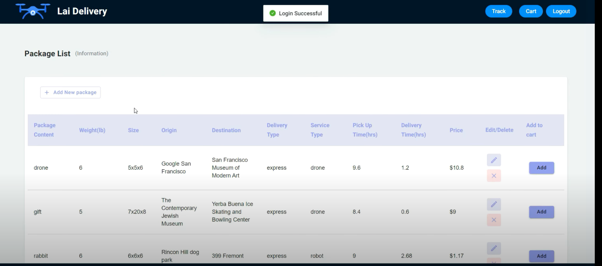

# DeliveryWebApp
This project was bootstrapped with [Create React App](https://github.com/facebook/create-react-app). Front-end paprt is implemented by Javascript, CSS, html and React, backend is execued in Java environment, with assistance of libraries of Spring framework, Hibernate and Tomcat. Database used for storing users' input was established on MySQL instance of AWS RDB system.

The introduction of details could be seen in [slides](https://github.com/hoseela41/DeliveryWebApp/blob/main/images/LaiDelivery%201.0%20Demo.pdf).

The demo video could be seen at [demo link](https://www.youtube.com/watch?time_continue=1&v=04vbk0RKcxw&feature=emb_title)


## How to run the project to launch the website
1. Set the application server to be Tomcat > 9.0 versioin.
3. The data has to be stored to [Amazon relational database service (RDS)](https://aws.amazon.com/rds/), please create your own RDS and import the data. Don't forget to change the url in the Application config file to connect to your own database.
4. Run Maven clean and install to import all dependencies we need.
5. Run Tomcat, wait for couple of minutes to have the project built.
6. Run ```npm build``` then ```npm start``` under laidelivery-app to start the frontend.
7. Open your browser, enter http://localhost:8080/ to connect to the website, and you will see the home page

## What can we do on this website
1. At beginning, here's the welcome page that you could start our webapp or enter a tracking number to know where your pacakge is.

2. At first page, please enter the account and passwod for log in. If it's your first time visiting the website, please hit *Register* button on top-right corner

2. Enter the information about your account, please note that error might pop-up if the content does not meet requirements.


3. After registration, you should be able to get back to home page, then enter your registered account and password. Hit the eyeball could show the password you entered.


4. Here's the main page of creating new pacakage or organizing previous pacakage list, hit add *Add new package* button if you want to add more packages.


5. Input the information of the pacakge you would like to deliver.


6. Options will pop up so that you could chose to use either drone or robot as your preferred delivery carrier. Use *radio button* for making decision.


7. Hit *add* button to add to be delivered packages into cart, and press *Cart* to see the total price and added orders. Hit *CheckOut* if you wish to complete the order.


8. Once checkout completes, you will get an notification sent to your email address for the use of tracking your pacakge. 


9. You could enter the pacakge number at welcome package or hit *Track* button on top-right corner to head into tracking page. Here you could know where your pakcage is and the estimated delivery time.


10. Ready for your or your friend to receive the gift!